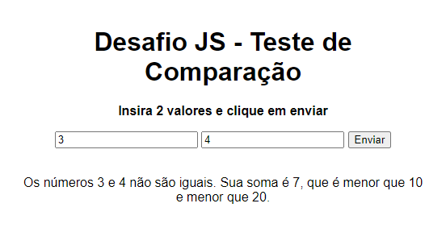

# Sintaxe e Operadores

Este repositório contém o desafio do curso "Sintaxe e Operadores" ministrado no *Bootcamp de Javascript*, ministrado pela *DIO*

<div align="center">
  
</div>

### Atividade
- Crie uma função que recebe dois números como parâmetros.
- Confira se os números são iguais.
- Confira se a soma dos números é maior que 10 ou menor que 20.
- Retorne uma string dizendo "Os números num1 e num2 não/são iguais. Sua soma é soma, que é maior/menor que 10 e maior/menor que 20".

Exemplo:

<code>
Input: 1, 2 <br>
Output: Os números 1 e 2 não são iguais. Sua soma é 3, que é menor que 10 e menor que 20.
</code>

### Minha atividade
Na minha versão desta atividade, adicionei uma página HTML para inserção dos valores desejados para a verificação, como no *print* acima. Ao clicar no botão ```Enviar```, a verificação é realizada e as informações são escritas logo abaixo.